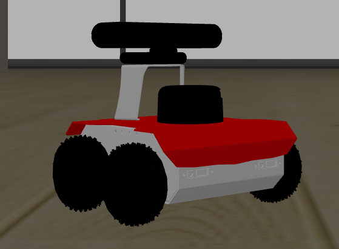
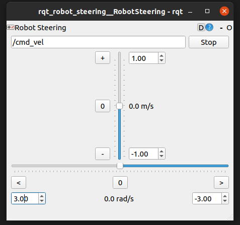
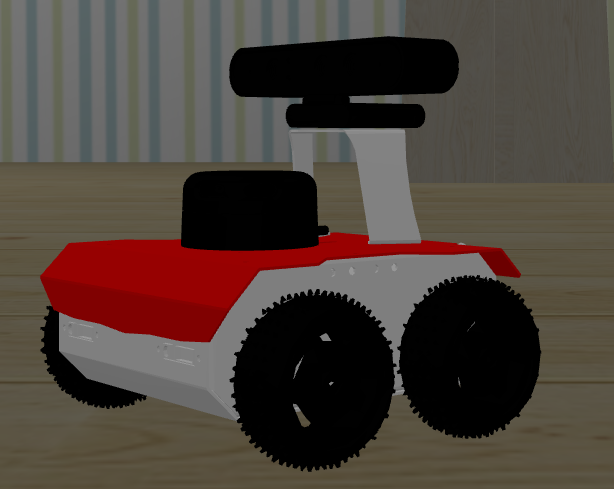
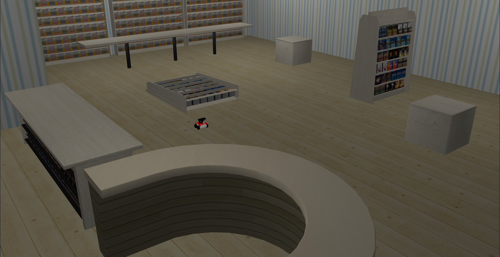
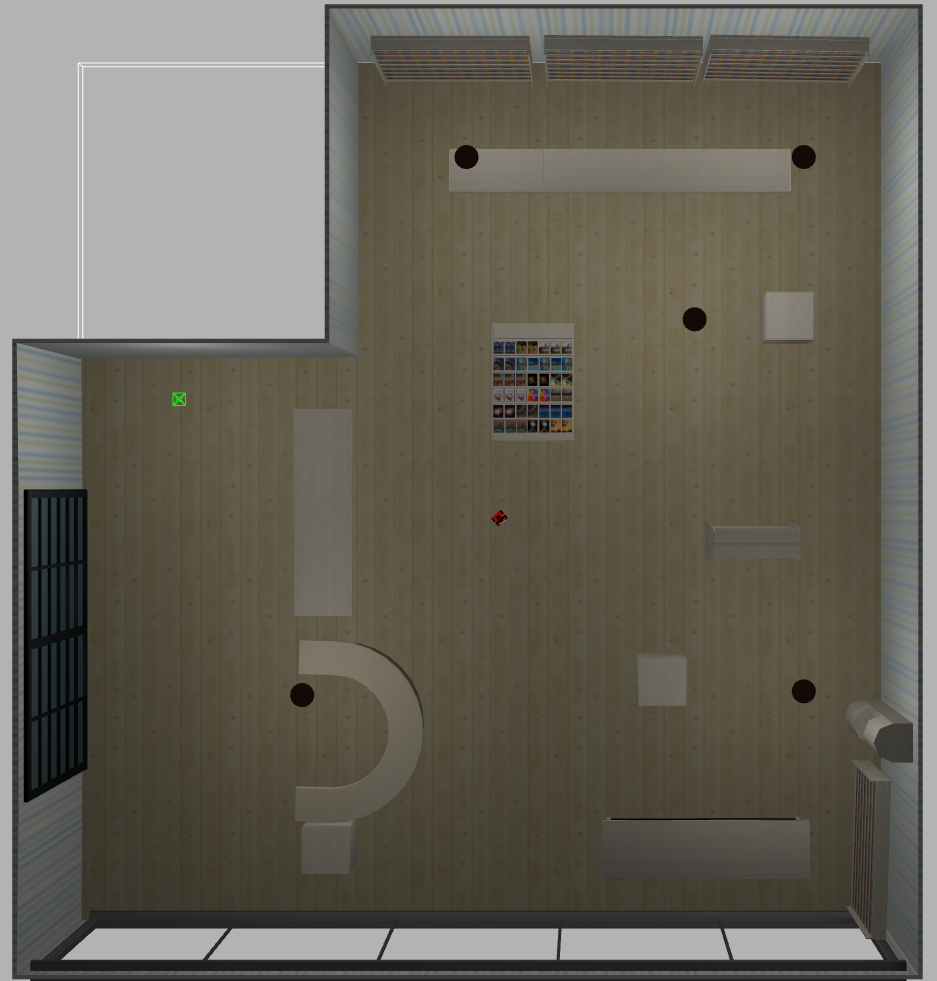
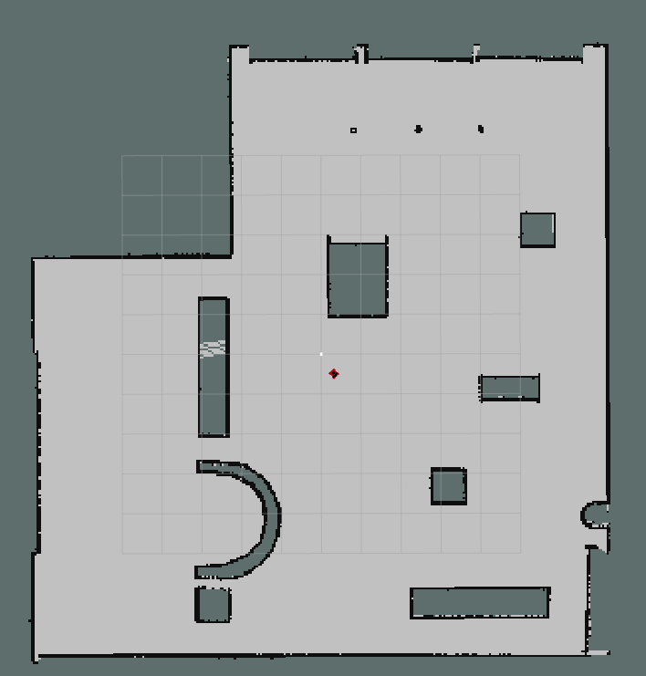

# ROS/Gazebo SLAM Demo

Our used vehicle is [Rosbot](https://husarion.com/manuals/rosbot/) with LIDAR, RGB-D camera, IMU sensors.




# How to Build

We have tested this code on Ubuntu 20.04 with `ROS noetic`

1- Install ROS and Gazebo
 ```bash
 # https://wiki.ros.org/noetic/Installation/Ubuntu
 
 sudo apt install curl wget gnupg apt-transport-https
 
 sudo sh -c 'echo "deb http://packages.ros.org/ros/ubuntu $(lsb_release -sc) main" > /etc/apt/sources.list.d/ros-latest.list'
 curl -s https://raw.githubusercontent.com/ros/rosdistro/master/ros.asc | sudo apt-key add -
 
 sudo sh -c 'echo "deb http://packages.osrfoundation.org/gazebo/ubuntu-stable `lsb_release -cs` main" > /etc/apt/sources.list.d/gazebo-stable.list'
 wget https://packages.osrfoundation.org/gazebo.key -O - | sudo apt-key add -
 
 sudo apt-get update
 
 sudo apt install ros-noetic-desktop-full
 sudo apt install python3-rosdep python3-rosinstall python3-rosinstall-generator python3-wstool build-essential python-is-python3
 
 sudo rosdep init
 rosdep update
 ```
 
  **NOTE**: We install `python-is-python3` wchich makes `/usr/bin/python` points to `/usr/bin/python3`
 
 
 2- Source your ROS installation
 
 **NOTE**: If you use are in a conda environment, deactivate it before using any ros commands `conda deactivate`
 ```bash
 source /opt/ros/noetic/setup.bash
 ```
 
 3- Clone the repo and enter it
 ```bash
 git clone https://github.com/3omar-mostafa/ROS.git
 cd ROS
 ```
 
 4- Install dependencies
 ```bash
 rosdep install --from-paths ./src -y
 ```
 
 5- Build
 ```bash
 catkin_make
 source ./devel/setup.bash
 ```
 
 # How to Run
 
 1- Run Using Mouse Controls
 ```bash
 roslaunch launcher bookstore_mouse.launch
 ```
 **NOTE**: add `gpu:=true` to roslaunch command to use gpu.


 
 
 ------------------------------------------------------
 
 2- Run Using Joystick Controller
 ```bash
 roslaunch launcher bookstore_joystick.launch
 ```
 **NOTE**: add `gpu:=true` to roslaunch command to use gpu.

 **How to Configure Joystick**: 
  * You can customize the controller input to fit your needs by following [this tutorial](https://wiki.ros.org/joy/Tutorials/ConfiguringALinuxJoystick)
  * Once you knew all the buttons you need, put these data in `src/config/xbox.config.yaml`

-------------------------------------------------------

# Robot
* We used [Rosbot](https://husarion.com/manuals/rosbot/) with LIDAR, RGB-D camera, IMU sensors.

* The robot description can be found on [github](https://github.com/husarion/ROSbot_description)

* A few modifications were made on the robot as changing its mass to be more stable in motion



-------------------------------------------------------

# Map
* Our map is a bookstore world, taken from [AWS RoboMaker](https://github.com/aws-robotics/aws-robomaker-bookstore-world)
* We have simplified the world because it was too crowded and complex in order to have faster loading and rendering in gazebo



-------------------------------------------------------

# SLAM Output
## This project is all using ready made packages for its functionality such as `gmapping` package


Original Map               |  SLAM Map
:-------------------------:|:-------------------------:
  |  
