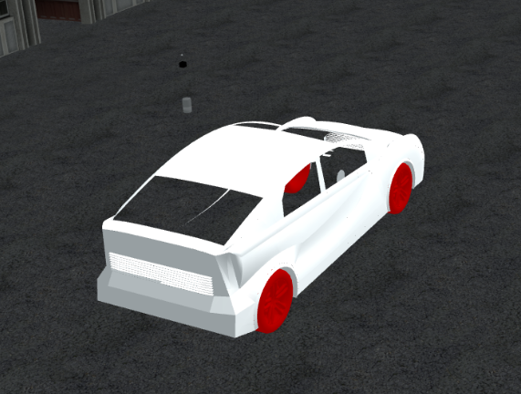
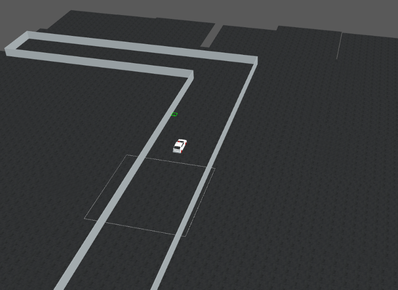
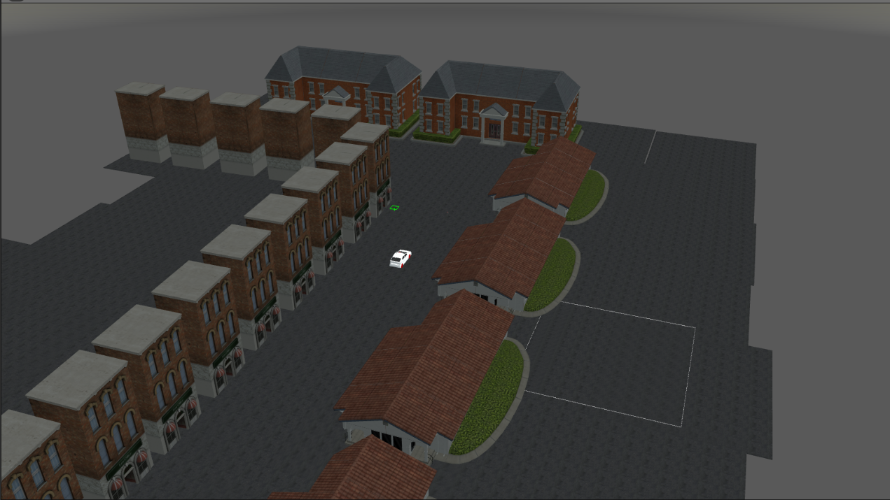
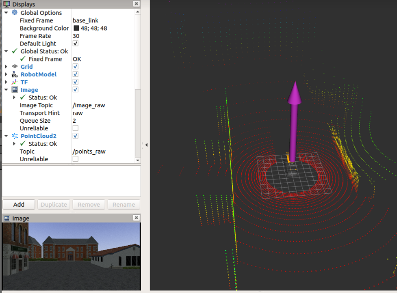
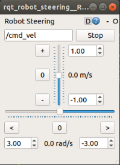

# ROS/Gazebo SLAM Environment

Vehicle model with (3D lidar, IMU and Camera sensors) can be simulated in 2 different maps.


-------------------------------------------------------------------------------------------

# How to Build

We have tested this code on Ubuntu 20.04 with `ROS noetic`

1- Install ROS
 ```bash
 # https://wiki.ros.org/noetic/Installation/Ubuntu
 
 sudo sh -c 'echo "deb http://packages.ros.org/ros/ubuntu $(lsb_release -sc) main" > /etc/apt/sources.list.d/ros-latest.list'
 sudo apt install curl gnupg apt-transport-https
 curl -s https://raw.githubusercontent.com/ros/rosdistro/master/ros.asc | sudo apt-key add -
 
 sudo apt install ros-noetic-desktop-full
 sudo apt install python3-rosdep python3-rosinstall python3-rosinstall-generator python3-wstool build-essential python-is-python3
 
 sudo rosdep init
 rosdep update
 ```
 
  **NOTE**: We install `python-is-python3` wchich makes `/usr/bin/python` points to `/usr/bin/python3`
 
 
 2- Source your ROS installation
 
 **NOTE**: If you use are in a conda environment, deactivate it before using any ros commands `conda deactivate`
 ```bash
 source /opt/ros/noetic/setup.bash
 ```
 
 3- Clone the repo and enter it
 ```bash
 git clone https://github.com/3omar-mostafa/ROS.git
 cd ROS
 ```
 
 4- Install dependencies
 ```bash
 rosdep install --from-paths ./src/vehicle_sim -y
 ```
 
 5- Build
 ```bash
 catkin_make
 source ./devel/setup.bash
 ```
 
 6- Upgrade gazebo and download gazebo models
 ```bash
 rosrun vehicle_sim_launcher setup.sh
 ```
 # How to Run
 
 1- Run Simple walls environment
 ```bash
 roslaunch vehicle_sim_launcher walls.launch
 ```
 
 
 -------------------------------------------------------------------------------------------
 
 2- Run complex city environment
 ```bash
 roslaunch vehicle_sim_launcher city.launch
 ```
 
 
 **NOTE**: add `gpu:=true` to roslaunch command to use gpu.

-------------------------------------------------------------------------------------------
Once you launch it, 3 windows will pop up:
  - Gazebo Simulation.
  - RVIZ : For visualization, you will find:
    1- Car model.
    2- Colored points representing lidar readings.
    3- Funny arrow representing IMU readings.
    4- Image to show camera output.
    Your map needs to be added to the list :)
    
    
  - Window to control vehicle velocity and steering.
  - 
    

-------------------------------------------------------------------------------------------
# Sample code
sample code exists in: `ROS/src/slam_code/scripts`
  - It subscribes to `/points_raw` topic which lidar publishes on.
  - Creates dumy PointCloud2 message to simulate the map which will be the output of the SLAM algorithm, then publishes it on ```/map``` topic.
  - Your SLAM code needs to be added to a script like this.

-------------------------------------------------------------------------------------------
# Citation

This is a based on work done by:
* [Yukihiro Saito](https://github.com/yukkysaito/vehicle_sim)
* [Belal Elhossany](https://github.com/BelalElhossany/SLAMEnvironment)
